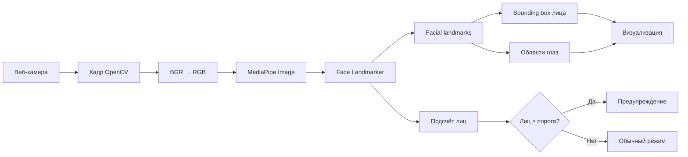

<div align="center">

# 👀 Machine Eyes Check

### Локальная система обнаружения нескольких людей перед экраном

Computer Vision-прототип на Python, OpenCV и MediaPipe, который обрабатывает
видеопоток с веб-камеры, находит лица и области глаз и предупреждает, когда в
кадре находится больше одного человека.


</div>

---

## О проекте

**Machine Eyes Check** — экспериментальный инструмент компьютерного зрения для
определения количества людей, находящихся перед монитором.

Приложение получает кадры с веб-камеры и обрабатывает их локально. MediaPipe
Face Landmarker определяет лица и возвращает набор нормализованных landmarks.
На их основе система вычисляет границы лица и областей глаз, отображает их в
реальном времени и показывает предупреждение при превышении заданного порога.

Проект может использоваться как основа для:

- контроля присутствия нескольких людей перед рабочим экраном;
- privacy-индикатора для приложений с чувствительными данными;
- прототипов прокторинга;
- исследований Computer Vision и facial landmarks;
- систем мониторинга рабочего места.

> Проект не распознаёт личности и не отправляет видеопоток во внешние сервисы.

---

## Что реализовано

- получение видеопотока с камеры через OpenCV;
- обнаружение до пяти лиц одновременно;
- работа с локальной моделью MediaPipe Face Landmarker;
- преобразование кадров из BGR в RGB;
- вычисление bounding box каждого лица;
- локализация левого и правого глаза по facial landmarks;
- отрисовка рамок лица и областей глаз;
- отображение количества найденных лиц;
- визуальное предупреждение при обнаружении нескольких людей;
- настройка камеры, модели, лимита лиц и порога предупреждения;
- корректное освобождение камеры и ресурсов детектора.

---

## Как это работает



### 1. Захват изображения

`cv2.VideoCapture` подключается к выбранной камере и последовательно получает
кадры. Индекс камеры можно передать через аргумент `--camera`.

### 2. Подготовка кадра

OpenCV использует порядок каналов BGR, а MediaPipe ожидает RGB. Перед анализом
каждый кадр преобразуется с помощью `cv2.cvtColor`.

### 3. Обнаружение лица

MediaPipe Face Landmarker обрабатывает кадр локальной моделью
`models/face_landmarker.task`. Для каждого найденного лица возвращается набор
точек с нормализованными координатами от `0` до `1`.

### 4. Перевод координат

Координаты landmarks умножаются на ширину и высоту кадра. Функция
`create_rectangle` находит минимальные и максимальные координаты всех точек и
формирует прямоугольник лица.

### 5. Поиск областей глаз

Для глаз используются определённые MediaPipe landmark indices:

```python
LEFT_EYE = [33, 160, 158, 133, 153, 144]
RIGHT_EYE = [362, 385, 387, 263, 373, 380]
```

Функция `eye_region` получает координаты этих точек и рассчитывает отдельный
bounding box для каждого глаза.

### 6. Предупреждение

Система сравнивает количество найденных лиц со значением `--alert-threshold`.
При достижении порога индикатор становится красным и на изображении появляется
сообщение `WARNING: multiple viewers`.

---

## Структура

```text
machine-eyes-check/
├── models/
│   └── face_landmarker.task    # локальная модель MediaPipe
├── utils/
│   ├── rectangle.py            # bounding box лица
│   └── search_eyes.py          # landmarks и области глаз
├── main.py                     # видеопоток и основной pipeline
├── requirements.txt
├── LICENSE
└── README.MD
```

---

## Установка

### Требования

- Python 3.10+;
- веб-камера;
- разрешение операционной системы на доступ к камере.

### Запуск

```bash
git clone https://github.com/nezqt3/machine-eyes-check.git
cd machine-eyes-check

python -m venv .venv
source .venv/bin/activate
pip install -r requirements.txt

python main.py
```

Для выхода нажмите `q` в окне видеопотока.

### Windows

```powershell
python -m venv .venv
.venv\Scripts\activate
pip install -r requirements.txt
python main.py
```

---

## Параметры запуска

```bash
python main.py \
  --camera 0 \
  --max-faces 5 \
  --alert-threshold 2 \
  --model models/face_landmarker.task
```

| Параметр | Значение по умолчанию | Назначение |
|---|---:|---|
| `--camera` | `0` | Индекс камеры OpenCV |
| `--max-faces` | `5` | Максимальное число лиц для детектора |
| `--alert-threshold` | `2` | Число лиц, при котором появляется предупреждение |
| `--model` | `models/face_landmarker.task` | Путь к модели Face Landmarker |

Если камера не открывается, попробуйте другой индекс:

```bash
python main.py --camera 1
```

---

## Технологии

- **Python** — основная логика;
- **OpenCV** — работа с камерой, кадрами и визуализацией;
- **MediaPipe Tasks Vision** — обнаружение facial landmarks;
- **NumPy** — обработка числовых данных внутри CV-зависимостей.

---

## Ограничения

- наличие лица в кадре не гарантирует, что человек смотрит непосредственно на
  экран;
- система не выполняет идентификацию или распознавание личности;
- качество зависит от освещения, положения камеры и видимости лица;
- сильный поворот головы и перекрытие лица могут снизить точность;
- текущая версия показывает локальное визуальное предупреждение, но не
  отправляет push-уведомления.

---

## Возможное развитие

- определение направления взгляда;
- расчёт Eye Aspect Ratio и фиксация закрытия глаз;
- head-pose estimation;
- системные уведомления при появлении второго человека;
- журнал событий без сохранения изображения;
- desktop-интерфейс и настройка чувствительности;
- тестирование на разных камерах и условиях освещения.

---

## Приватность

Все кадры анализируются локально в оперативной памяти. Текущая реализация не
записывает видео на диск и не передаёт изображения по сети.
